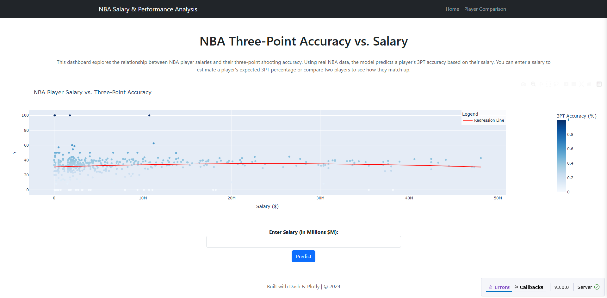
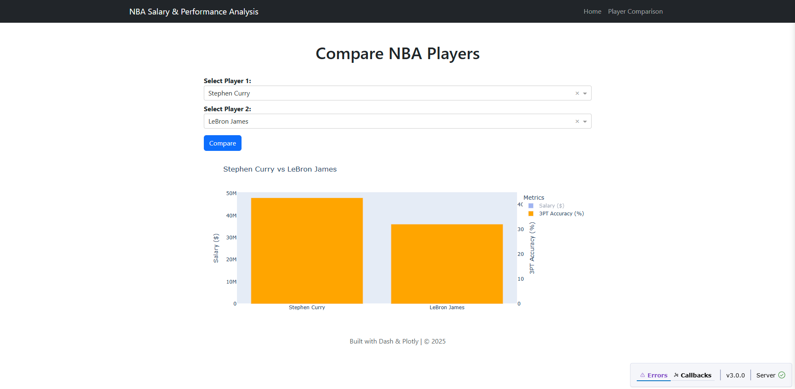

# 🏀 NBA 3PT Accuracy Prediction Dashboard

📊 **An interactive web app that predicts an NBA player's three-point shooting accuracy based on their salary.**  

##  Features
**Salary vs. 3PT% Prediction** – Predicts an NBA player's three-point accuracy based on their salary using a **polynomial regression model**.  
**Interactive Scatter Plot** – Visualizes the relationship between **player salaries and 3PT shooting efficiency** with a **trendline**.  

**Player Comparison Tool** – Select **two NBA players** and compare their **salary & 3PT%** side by side.

**Dynamic & Responsive UI** – Built with **Dash, Plotly, and Bootstrap** for a modern experience.
